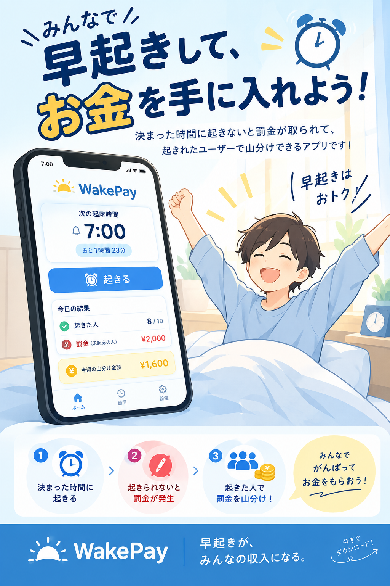

# サービス名 WakePay

フェーズ2の起動・DB設定・API仕様・テスト手順は [引き継ぎドキュメント](docs/phase2-handoff.md) を参照してください。

フェーズ2.5の画面・API・移行SQLを実装しています。[実装と起動手順](docs/phase2.5-implementation.md)、[改訂技術設計書](docs/wakepay-technical-design.md)、[DB引き継ぎ書](docs/phase2.5-db-handoff.md)を参照してください。利用前にDB担当者が `supabase/phase2.5.sql` を適用する必要があります。

## チーム名　チーム朝弱い

二度寝を防止したい、翌日に外せない用事を控える人向けの、WakePayというプロダクトは起床支援アプリです。
これはお金と友達の目があるから、意志力だけに頼らず確実に起きることができ、既存の目覚ましアプリとは違って
前日に友達とお金を賭け合い、起床確認ができなかった人の分を、できた人で分配する仕組みが備わっています。

